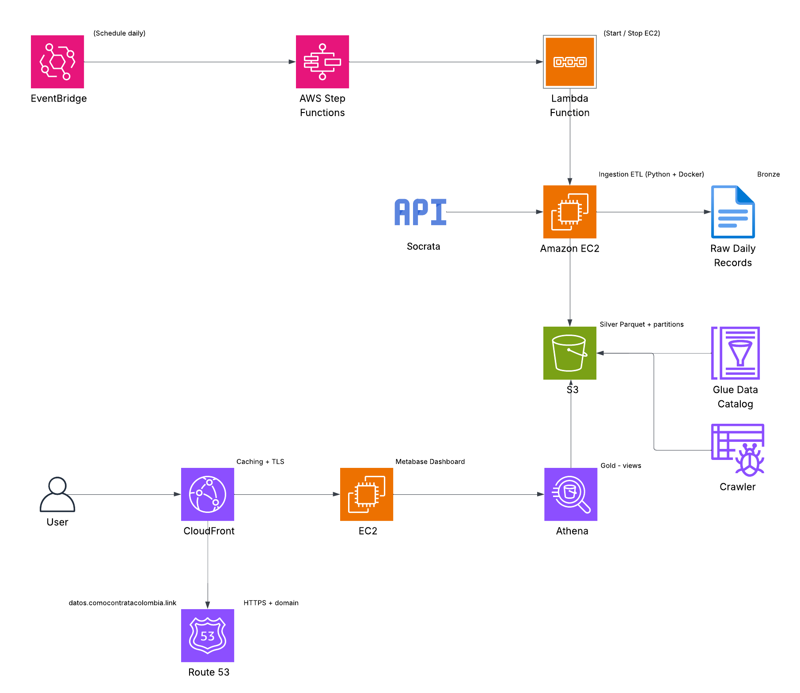
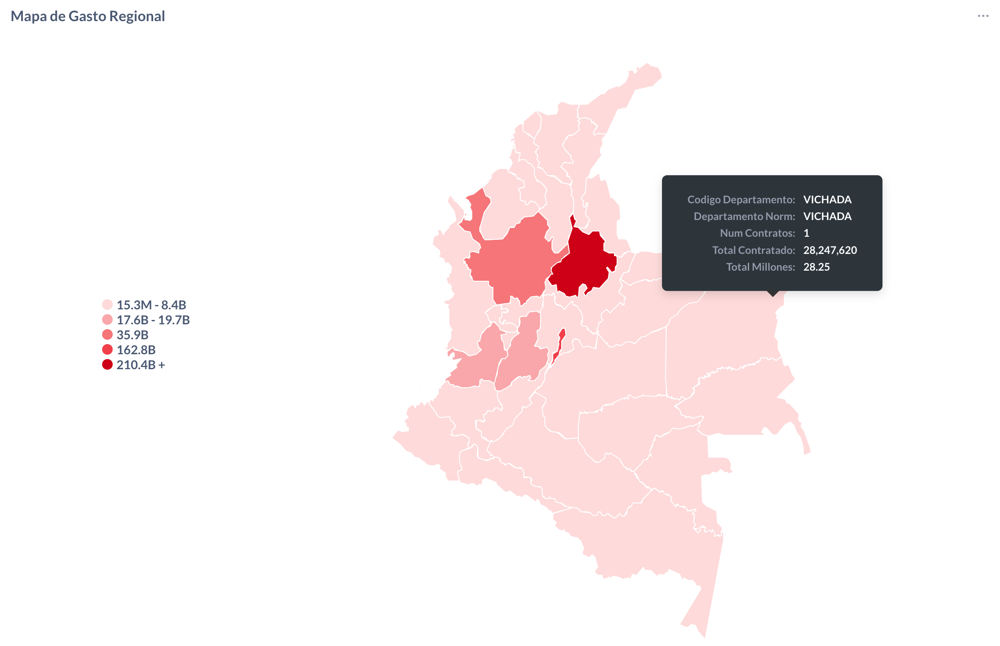
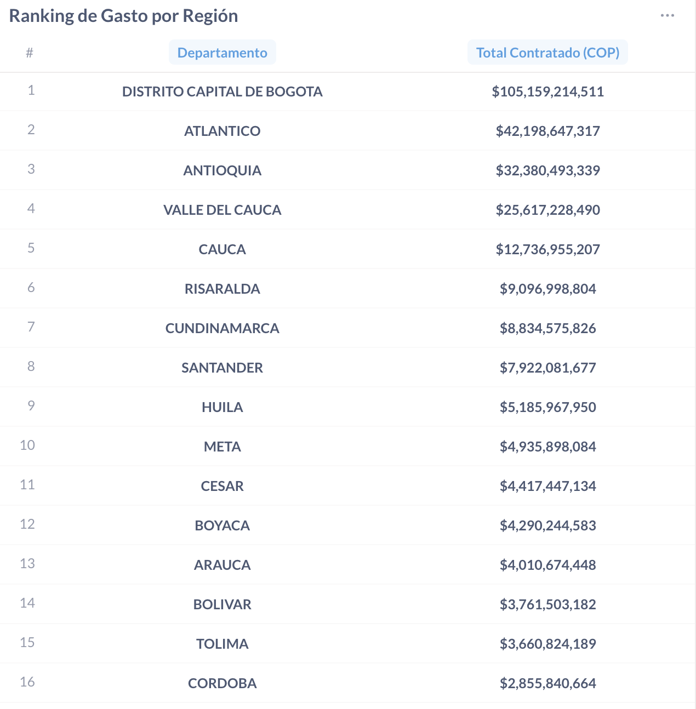
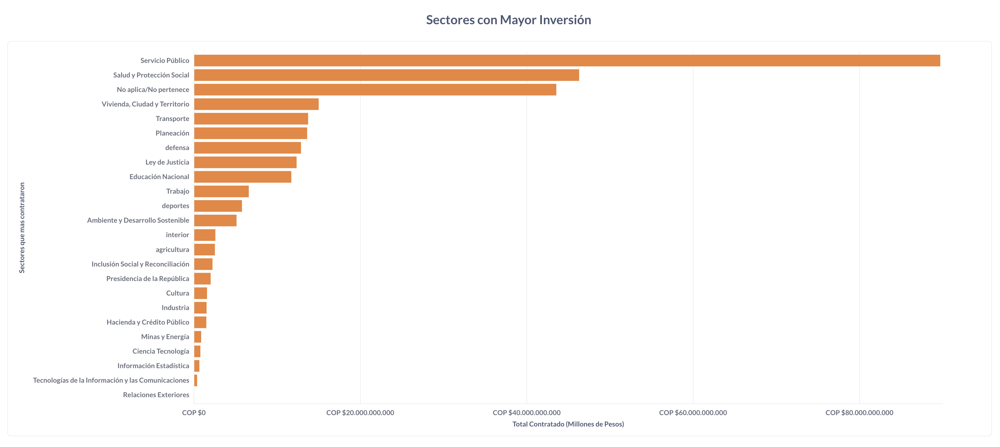
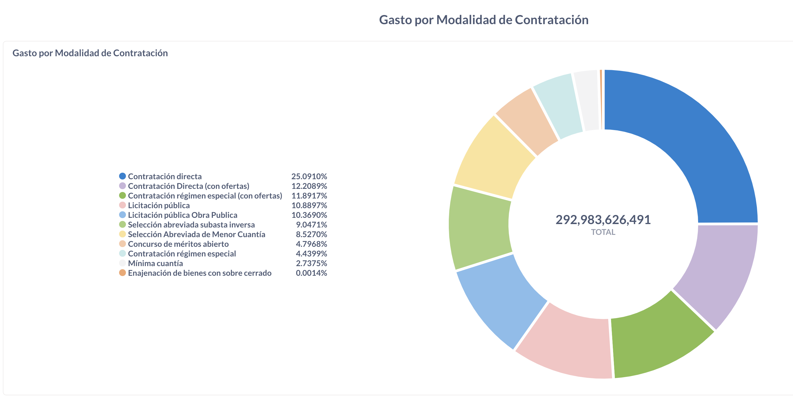
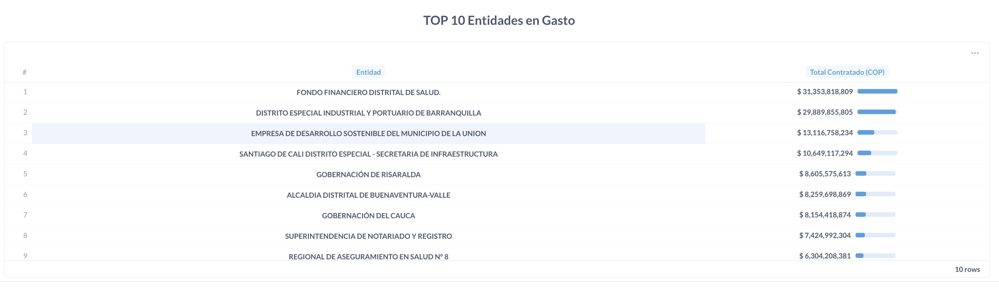

# 🏗️ Serverless Data Lakehouse on AWS with Open Government Data (SECOP II – Colombia)


## 📖 Introduction

This project implements a **serverless data lakehouse** on **AWS** to process and visualize **open government procurement data (SECOP II – Colombia)**.  
The goal is to transform millions of raw records into structured, queryable, and publicly accessible insights — all with a **cost-efficient, scalable, and automated** architecture.

You can read the full technical article on Medium:  
🔗 [Building a Serverless Data Lakehouse on AWS with Open Government Data](https://medium.com/@juancamilo110599/building-a-serverless-data-lakehouse-on-aws-with-open-government-data-3872355883e9)

---

## 🧩 Problem Description

The **SECOP II** portal publishes millions of public procurement records, each with over 90 attributes including entity names, contract values, locations, and dates.  
While the data is open, it’s **not optimized for analytics** — making it difficult to build transparency dashboards or perform large-scale analysis.

### The challenges
- Datasets are massive and constantly updated.
- The raw API format (JSON/CSV) lacks schema consistency.
- Queries on unstructured data are slow and expensive.
- Manual updates are not sustainable for daily ingestion.

### The solution
This project automates:
1. **Daily ingestion** of SECOP II data (D-2 logic to ensure completeness).  
2. **ETL transformations** into Parquet/Delta formats for efficient querying.  
3. **Data exposure** through a public dashboard built on Metabase + Athena.

All orchestrated with a **fully serverless AWS stack** for zero-maintenance and low-cost operation.

---

## 📊 Original Dataset

**Source:** [SECOP II API (Colombia)](https://www.datos.gov.co/Compras-y-Contrataciones/Contratos-SECOP-II/jbjy-vk9h)  
**Provider:** Agencia Nacional de Contratación Pública – Colombia Compra Eficiente  
**Format:** JSON / CSV via Socrata API  

### Dataset overview
- ~5 million records
- Updated daily
- Over 90 fields including:
  - `fecha_firma`
  - `valor_del_contrato`
  - `nombre_entidad`
  - `departamento`
  - `sector`
  - `modalidad_de_contratacion`
  - `estado_del_contrato`

A **D-2 ingestion policy** is used — meaning data is processed up to two days before the current date to ensure all records are complete and published.

---

## ☁️ Architecture Overview



This architecture follows a **Medallion (Bronze / Silver / Gold)** model with **serverless orchestration**.

### 🧱 Layers

| Layer | Description |
|:------|:-------------|
| **Bronze (Raw)** | Stores raw JSON/CSV data fetched from SECOP II API in S3 |
| **Silver (Processed)** | Transformed and cleaned Parquet data using Python ETL scripts |
| **Gold (Analytics)** | Aggregated and curated views in Athena, ready for dashboards |

### ⚙️ AWS Components

| Component | Role |
|------------|------|
| **Amazon EventBridge** | Triggers daily Step Functions workflow |
| **AWS Step Functions** | Orchestrates EC2 lifecycle (start → ingest → stop) |
| **AWS Lambda** | Manages EC2 instance lifecycle and event orchestration |
| **Amazon EC2** | Runs ingestion & transformation scripts (Python + Pandas + DuckDB/Delta) |
| **Amazon S3** | Central data lake storage (Bronze, Silver, Gold layers) |
| **AWS Glue Data Catalog** | Manages table schemas and metadata for Athena |
| **Amazon Athena** | Executes SQL queries and exposes Gold views |
| **Metabase** | Visualization layer connected to Athena |
| **AWS CloudFront + Route 53** | Hosts dashboards with HTTPS and custom domain (e.g., `https://datos.tu-dominio.com`) |

### 🔄 Data Flow

```text
EventBridge → Step Functions → Lambda → EC2 (ETL)
      ↓
     S3 (Bronze → Silver → Gold)
      ↓
  Glue Data Catalog → Athena → Metabase Dashboards
```

### 💰 Cost optimization strategies
- EC2 instance auto-starts only during ingestion.
- S3 lifecycle policies to move data to cheaper storage tiers.
- Athena partition pruning and Parquet compression.
- Serverless components ensure near-zero idle cost.

---

## 📈 Dashboards

Dashboards are built using **Metabase**, connected directly to **Athena**.  
They visualize procurement data across multiple dimensions to promote **transparency and insight** into public spending.

| Dashboard | Description |
|------------|--------------|
| **Contracts by Department** | Shows total contract values and counts by region. |
| **Contracts by Sector** | Highlights which sectors have the highest investment levels. |
| **Procurement Modality Analysis** | Distribution of contracting methods (e.g., licitación, mínima cuantía, etc.). |
| **Top Contracting Entities** | Top 10 entities by total contracted value. |







---

## 🧰 Tech Stack

| Category | Tools |
|-----------|-------|
| **Data Source** | SECOP II (Socrata API) |
| **Data Processing** | Python, Pandas, DuckDB, Delta Lake |
| **Storage** | Amazon S3 |
| **Orchestration** | AWS Step Functions, Lambda, EventBridge |
| **Metadata & Query** | AWS Glue, Athena |
| **Visualization** | Metabase |
| **Deployment & Infra** | AWS EC2, CloudFront, Route 53 |

---

## 🧠 Key Takeaways

- Fully **serverless** and **scalable** open-data lakehouse on AWS.  
- Daily ingestion and transformation of millions of records.  
- Clean architecture following the **Medallion pattern**.  
- Public transparency through live dashboards.  
- Low-cost operation with automated resource management.

---

## 🧾 References

- Medium Article: [Building a Serverless Data Lakehouse on AWS with Open Government Data](https://medium.com/@juancamilo110599/building-a-serverless-data-lakehouse-on-aws-with-open-government-data-3872355883e9)
- [SECOP II API – Datos Abiertos Colombia](https://www.datos.gov.co/Compras-y-Contrataciones/Contratos-SECOP-II/jbjy-vk9h)
- AWS Documentation: [Data Lake on AWS](https://aws.amazon.com/solutions/data-lake-on-aws/)
- Metabase: [https://www.metabase.com](https://www.metabase.com)

---

## 📬 Author

**Juan Camilo Pimienta Gómez**  
💼 Data Engineer | Backend Developer | Open Data Enthusiast  
🌐 [Medium](https://medium.com/@juancamilo110599) • [GitHub](https://github.com/juancamil-o) • [LinkedIn](https://www.linkedin.com/in/juan-camilo-pimienta-g/)
